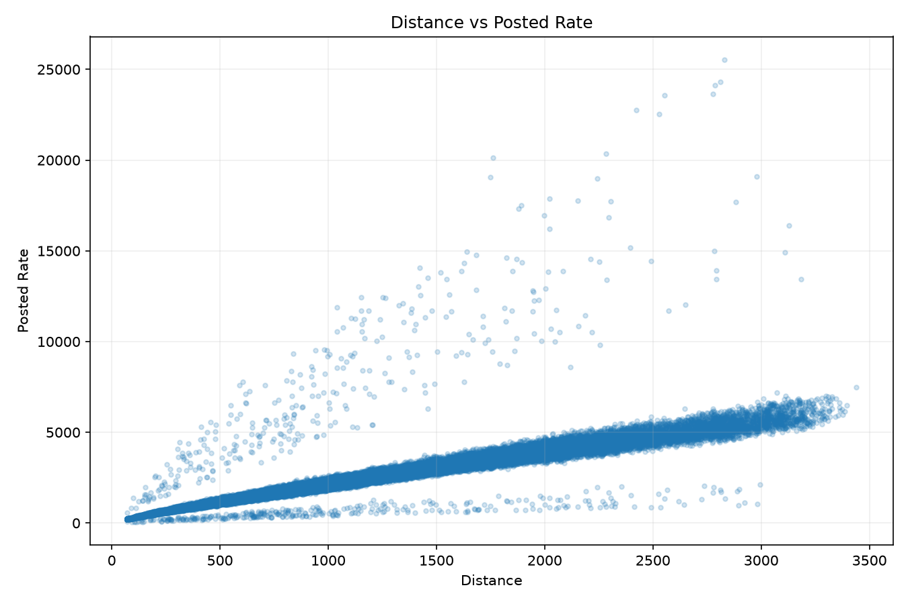
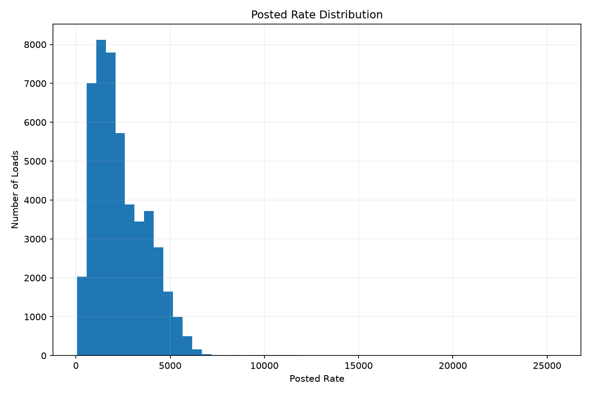
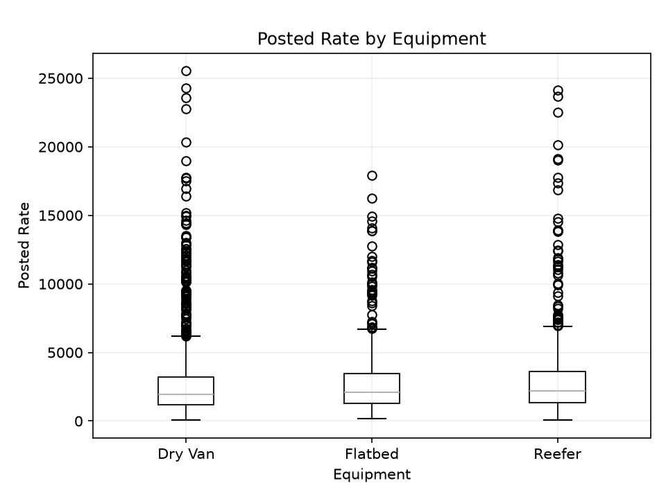
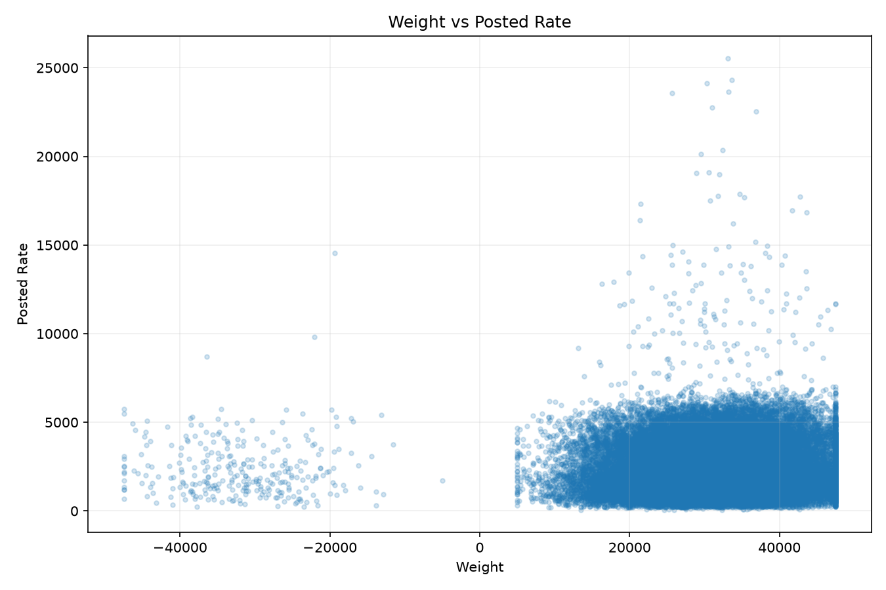
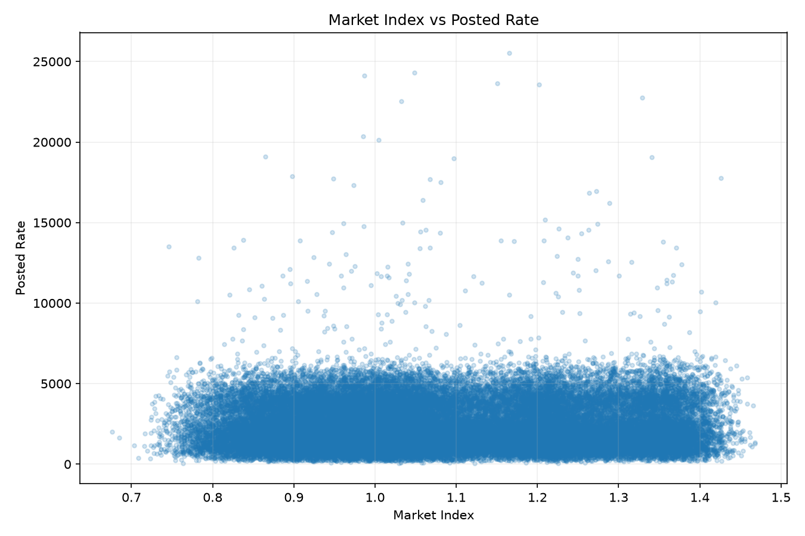
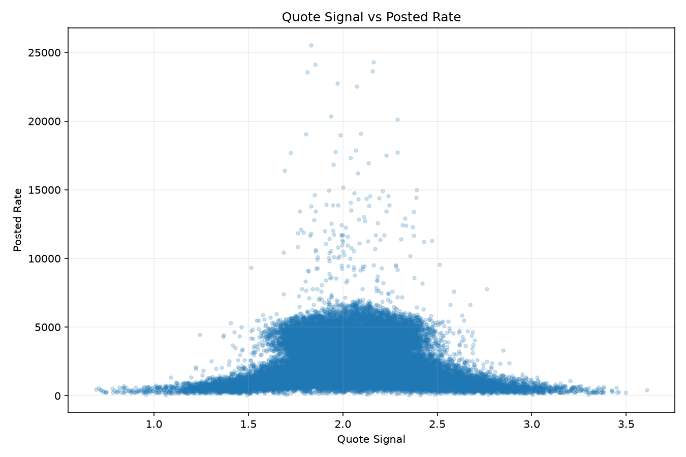
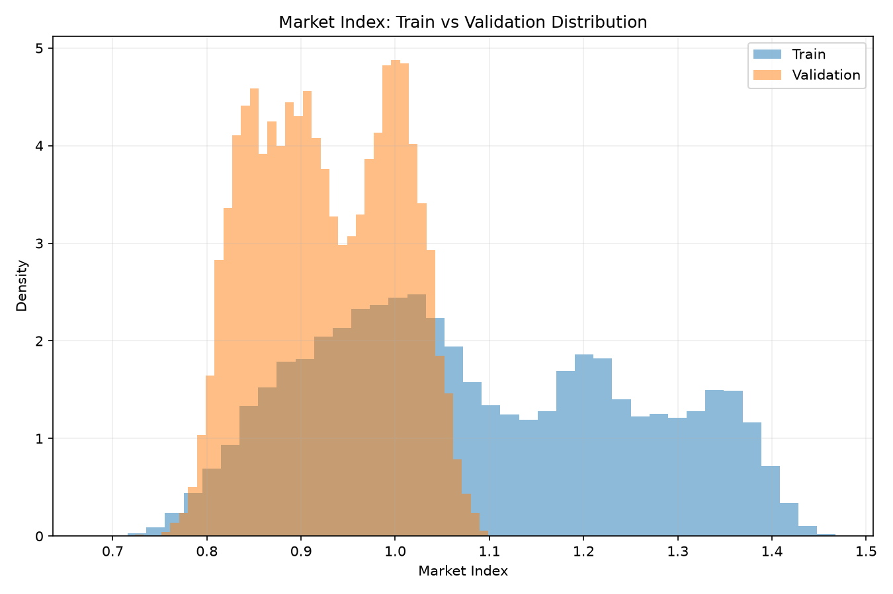

# Freight Rate Prediction Challenge

## Objective

Predict freight (truckload) rates using historical load data. The model
is trained on `data/train-test.csv` (48,000 labeled loads with an actual
posted rate), then used to predict:

1. `data/validation.csv` - 12,000 loads with no rate, scored by the
   assessment provider.
2. `data/december-chart-inputs.csv` - the same fixed lane (Lexington to
   Fort Wayne) repeated once per day across December 2025, used to
   sanity-check how the model's predictions move over time.

See `Freight_Rate_ML_Assessment.pdf` for the original assessment brief.

## Dataset

| File | Rows | Purpose |
|---|---|---|
| `data/train-test.csv` | 48,000 | Labeled data (has `posted_rate`) used to train and validate the model |
| `data/validation.csv` | 12,000 | Unlabeled loads to predict for final submission |
| `data/december-chart-inputs.csv` | 31 | One fixed lane, one row per December day, used for the required prediction chart |

Each load has: pickup/delivery city and coordinates, distance, equipment
type (Dry Van / Reefer / Flatbed), weight, date, `market_index`,
`quote_signal`, and (for training data) `posted_rate` - the target.

## Pipeline

```
Raw data
   |
   v
EDA                        (eda/)
   |
   v
Preprocessing               (preprocessing/)   - cleans data, leak-free
   |
   v
Feature engineering         (feature_engineering/)
   |
   v
Time-based validation        (modeling/tune_hgb.py)
   |
   v
Tuned HGB model             (modeling/tune_hgb.py)
   |
   v
Train final model on ALL training data
   |
   v
validation_predictions.csv / data/december_predictions.csv
                             (modeling/train_final.py, modeling/predict_december.py)
```

## Project structure

```
freight-rate-ml/
|-- data/
|   |-- train-test.csv                      RAW - never modified
|   |-- validation.csv                      RAW - never modified
|   |-- december-chart-inputs.csv           RAW - never modified
|   |-- validation-predictions-template.csv RAW - never modified
|   |-- processed/                          generated by preprocessing + feature_engineering
|   |-- december_predictions.csv            FINAL output
|-- eda/
|   |-- explore_data.py                     exploratory analysis (stats, correlations)
|   |-- generate_plots.py                   saves the EDA charts used below
|   |-- plots/                              saved EDA chart images
|-- preprocessing/                          FINAL pipeline step 1
|   |-- preprocess.py                       FreightPreprocessor: cleaning + imputation
|   |-- run_preprocessing.py                runs it on train-test.csv / validation.csv
|   |-- artifacts/                          learned medians (fit on training data only)
|-- feature_engineering/                    FINAL pipeline step 2
|   |-- feature_engineering.py              FeatureEngineer: route/date/equipment features
|   |-- run_feature_engineering.py          runs it, produces model-ready tables
|   |-- artifacts/                          learned equipment categories
|-- modeling/                               FINAL pipeline steps 3-5
|   |-- tune_hgb.py                         hyperparameter search (3 time windows) -> tuned params
|   |-- train_final.py                      trains final model, writes validation_predictions.csv
|   |-- predict_december.py                 same final model, writes december_predictions.csv
|   |-- predict_single_load.py              CLI demo: predict a rate for one load you describe
|-- experiments/                            exploratory/comparison scripts (not required to
|   |-- 01_baseline_random_forest.py        reproduce the final submission, kept for the
|   |-- 02_log_target_random_forest.py      record of what was tried and why it was or
|   |-- 03_hgb_log_target.py                wasn't kept - see "Model selection story" below)
|   |-- 04_multi_window_stability_check.py
|   |-- 05_xgboost_comparison.py
|   |-- 06_feature_engineering_tests.py
|   |-- 07_negative_weight_treatment.py
|   |-- 08_error_analysis.py
|   |-- 09_catboost_comparison.py
|   |-- 10_hgb_local_refinement.py
|   |-- extras/                             4 further robustness experiments run AFTER the
|                                            final model was chosen (see "Robustness testing"
|                                            below) - none changed the final pipeline
|-- tests/                                  automated tests (pytest) for the pipeline and
|                                            the final submission files - see "Testing" below
|-- reports/
|   |-- freight_rate_prediction_report.pdf  final written report (this project's deliverable)
|   |-- build_report.py                     regenerates the PDF above
|   |-- december_prediction_chart.png       preliminary chart (made before score.py was
|   |                                       available) - superseded by scorer_results/ below
|-- scorer_results/
|   |-- candidate_december.png              OFFICIAL chart, produced by score.py
|-- .github/workflows/tests.yml             CI: runs the test suite on every push
|-- score.py                                official scorer (provided, unmodified)
|-- validation_predictions.csv              FINAL submission file
|-- requirements.txt                        dependencies needed to run the pipeline
|-- requirements-dev.txt                    requirements.txt + pytest, for running tests/
```

## Data-quality decisions

EDA (`eda/explore_data.py`) found several issues, each handled explicitly
in `preprocessing/preprocess.py`:

- **Missing `weight`** (300 train / 165 validation rows) and **missing
  `market_index`** (374 / 249 rows): imputed with the **training-only**
  median, plus a `_was_missing` flag column so the model can learn
  whether missingness itself is informative.
- **Negative `weight`** (292 rows, ~0.6%): investigated and found to be
  spread evenly across equipment types and months with normal-looking
  rates - consistent with a sign-flip data-entry error, not a distinct
  category. Fixed with `abs(weight)` plus a `weight_was_negative` flag.
  This was re-tested later (see `experiments/07_negative_weight_treatment.py`)
  against two alternatives and confirmed as the best option.
- **Unseen validation cities** (8 pickup/delivery cities in
  `validation.csv` that never appear in training): handled by dropping
  raw city names entirely and relying on `pickup_lat/lon` and
  `delivery_lat/lon`, which are well-defined for any city.
- **`market_index` train/validation distribution shift**: training
  values are noticeably higher than validation's (see chart below).
  Deliberately **not** corrected/rescaled - that would fabricate
  information the model doesn't actually have. Flagged as a known
  limitation instead.

## Features

Built in `feature_engineering/feature_engineering.py`:

- One-hot encoded `equipment` (Dry Van / Reefer / Flatbed)
- Route features from coordinates only (safe for unseen cities):
  `delta_lat`, `delta_lon`, `haversine_distance` (straight-line distance)
- `log_distance` and `route_directness` (actual distance / straight-line
  distance - flags indirect routes)
- `distance_x_<equipment>` interactions (lets each equipment type have
  its own rate-per-mile slope)
- Calendar features: `month`, `day_of_week`, and a sin/cos pair of
  day-of-year (so Dec 31 and Jan 1 are numerically close)
- `market_index`/`quote_signal` kept raw - interaction features were
  tested (`experiments/06_feature_engineering_tests.py`) and dropped
  because none improved results consistently across validation windows

## Validation strategy

Random splits were avoided because the task is inherently a forecasting
problem (train on the past, predict the future). Instead:

1. **Chronological split**: train on early months, validate on later,
   unseen months - never the reverse.
2. **Multiple time windows**, not just one cutoff, to confirm the model
   is stable rather than lucky on a single split
   (`experiments/04_multi_window_stability_check.py`):

   | Window | Train | Validate |
   |---|---|---|
   | 1 | Jan 1 - Jun 30 | Jul 1 - Aug 31 |
   | 2 | Jan 1 - Jul 31 | Aug 1 - Sep 30 |
   | 3 | Jan 1 - Aug 31 | Sep 1 - Oct 31 |

   Results were stable across all three (MAE within a $6.53 band, R2
   within 0.005), giving confidence the model generalizes rather than
   overfitting to one arbitrary cutoff.
3. Hyperparameter tuning (`modeling/tune_hgb.py`) selected the
   configuration with the best **average and most consistent** MAE
   across all 3 windows - not the best score on any single window.
4. `data/validation.csv` was never used to train, tune, or select any
   model - it has no true rate to compare against and is reserved
   purely for the final submission.

## Model selection story

Each step below is a real, isolated experiment (see `experiments/`),
kept only if it won consistently across all 3 validation windows:

| Step | Model | Avg MAE | Avg RMSE | Avg R2 | Kept? |
|---|---|---|---|---|---|
| 1 | Random Forest (raw target) | 186.29 | 686.16 | 0.7978 | baseline |
| 2 | Random Forest + log1p target | 169.41 | 656.64 | 0.8149 | yes - log-target reduced right-skew error |
| 3 | HistGradientBoostingRegressor + log1p | 128.98 | 639.57 | 0.8244 | yes - boosting outperformed bagging |
| 4 | Tuned HGB (small random search, 3-window avg) | **119.40** | **627.96** | **0.8260** | yes - final model |
| - | XGBoost (untuned baseline) | 145.07 | 638.03 | 0.8203 | no - behind tuned HGB |
| - | CatBoost (baseline config) | 119.87 | 627.94 | 0.8260 | no - tied, not better |
| - | Local refinement around tuned HGB | no config beat it consistently | | | no changes made |
| - | market_index x month / quote_signal x distance / weight/distance | none improved consistently across all 3 windows | | | dropped |
| - | Negative weight: fold into "missing" / leave unchanged | both worse than abs() + flag | | | dropped |

**Final model**: `HistGradientBoostingRegressor` trained on
`log1p(posted_rate)`, predictions converted back with `expm1()`.

```python
{
    "learning_rate": 0.05,
    "max_iter": 300,
    "max_leaf_nodes": 15,
    "max_depth": 10,
    "min_samples_leaf": 50,
    "l2_regularization": 1.0,
}
```

### Final metrics (average across the 3 time windows)

| Metric | Value |
|---|---|
| MAE | $119.40 |
| RMSE | $627.96 |
| R2 | 0.8260 |

### Known limitation

Error analysis (`experiments/08_error_analysis.py`) found that error is
heavily concentrated in a small tail: the 269 loads (0.9%) with
`posted_rate > $6,000` have an average error of ~$3,872, versus ~$84 for
everything else. The model is very accurate on typical loads and
noticeably weaker on rare, expensive long-haul loads. This was measured,
not fixed - a fix would need a fundamentally different approach (e.g. a
separate model for the tail) which was out of scope here.

## Robustness testing (after the final model was chosen)

Once the final model was selected, 4 further ideas were tested to see
if it could still be improved - all in `experiments/extras/`, all
using the same 3 validation windows and the same decision rule (reject
anything that isn't a *consistent* improvement across all 3 windows):

| Idea | Result |
|---|---|
| Predict rate-per-mile instead of posted_rate | Worse and inconsistent - rejected |
| Extra lat/lon-derived geometry features | No consistent improvement - rejected |
| Historical average rate per route | Made results notably worse (too noisy with only 64 routes) - rejected |
| Explicit long-haul / high-rate flags | No effect - the model already uses distance to capture this on its own |

None of these changed the final pipeline. This round of testing is
itself a useful result: it shows the tuned model is close to the
practical ceiling of what this feature set and data can support, rather
than something that was only lightly checked.

## Testing

`tests/` contains pytest tests for the pipeline logic and the final
submission files:

```bash
python -m pip install -r requirements-dev.txt
pytest tests/ -v
```

- `test_preprocessing.py` - checks FreightPreprocessor's imputation,
  negative-weight handling, and flag columns behave as documented above.
- `test_feature_engineering.py` - checks FeatureEngineer's one-hot
  encoding, route features, and handling of an unseen equipment category.
- `test_submission_format.py` - re-checks `validation_predictions.csv`
  and `data/december_predictions.csv` against the same format rules
  `score.py` enforces (skipped automatically if those files don't exist
  yet).

A GitHub Actions workflow (`.github/workflows/tests.yml`) runs this
suite automatically on every push.

## Try it yourself

`modeling/predict_single_load.py` predicts a rate for one load you
describe on the command line, using the exact same final model,
preprocessing, and feature engineering as the real pipeline:

```bash
python modeling/predict_single_load.py \
    --pickup "Richmond" --delivery "Baltimore" \
    --distance 274 --equipment "Dry Van" --weight 30658 --date 2025-12-15
```

## Exploratory Data Analysis

Full EDA code and printed statistics: `eda/explore_data.py`. Charts
below are generated by `eda/generate_plots.py` (same data, same logic)
and saved to `eda/plots/`.

### 1. Distance vs Freight Rate



Distance has a strong, clearly visible positive relationship with
`posted_rate` (correlation ~0.91) - the strongest single signal found
during EDA, and the main driver behind the final model's accuracy.

### 2. Posted Rate Distribution



The target is right-skewed: most loads cluster at lower rates with a
long tail of rare, high-value loads. This motivated testing a
`log1p(posted_rate)` target transform, which was confirmed to improve
MAE, RMSE, and R2 (see Model Selection Story above).

### 3. Posted Rate by Equipment



Reefer and Flatbed loads run somewhat higher on average than Dry Van,
though all three distributions overlap substantially. Equipment was
retained as a one-hot encoded model feature.

### 4. Weight vs Posted Rate



The overall relationship between weight and rate is weak. The chart
also makes the negative-weight data-quality issue directly visible (the
separate cluster on the left) - handled with `abs(weight)` plus a
`weight_was_negative` flag, as described above.

### 5. Market Index vs Posted Rate



No strong direct linear relationship with `posted_rate` (matches the
low ~0.03 correlation). Kept as a feature since it may still carry
non-linear or interaction signal for a tree-based model.

### 6. Quote Signal vs Posted Rate



Similarly weak direct linear relationship. Retained for the same reason
as market_index.

### 7. Market Index: Train vs Validation Shift



The clearest distribution shift found in EDA: validation's market_index
values sit noticeably lower than training's. This was deliberately left
uncorrected (see Data-quality decisions above) rather than rescaled to
match training, since doing so would fabricate information the model
doesn't have about the future.

### Key EDA findings

- **Distance** is by far the strongest predictor (correlation ~0.91).
- **`posted_rate`** is right-skewed with a long high-value tail -
  motivated the log-target transform.
- **Equipment** shows real but modest rate differences; kept as a
  feature.
- **Weight** has a weak direct relationship and a data-quality issue
  (negative values) that was investigated and fixed.
- **`market_index`/`quote_signal`** are weak linear predictors alone,
  kept for possible non-linear signal (later tested combinations did
  not improve results).
- **8 validation cities** never appear in training - handled via
  coordinates instead of city names.
- **`market_index` shifts** between train and validation - a known,
  unfixed limitation, documented rather than papered over.

## How to reproduce the final pipeline

```bash
python -m pip install -r requirements.txt

# 1. Preprocessing (cleans data, fits medians on training data only)
python preprocessing/run_preprocessing.py

# 2. Feature engineering (builds model-ready tables)
python feature_engineering/run_feature_engineering.py

# 3. (Optional) re-run the hyperparameter search that selected the final params
python modeling/tune_hgb.py

# 4. Train the final model on all training data, predict validation.csv
python modeling/train_final.py
# -> writes validation_predictions.csv

# 5. Predict December and generate the chart
python modeling/predict_december.py
# -> writes data/december_predictions.csv

# 6. Run the official scorer
python score.py --predictions validation_predictions.csv --december-predictions data/december_predictions.csv
# -> validates both files, writes scorer_results/candidate_december.png
```

Steps 1-2 must run before 4-5 since those scripts consume
`data/processed/*.csv`. Step 3 is optional - its output (the tuned
hyperparameters) is already hardcoded into `train_final.py` and
`predict_december.py`.

To explore the experiments referenced in the Model Selection Story
table, run any script in `experiments/` directly, e.g.:
```bash
python experiments/04_multi_window_stability_check.py
```
